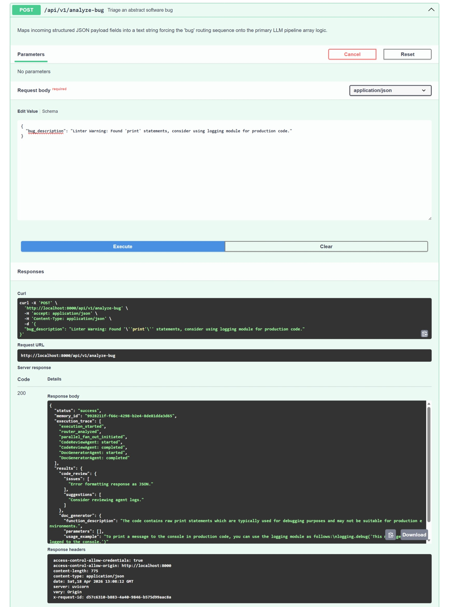
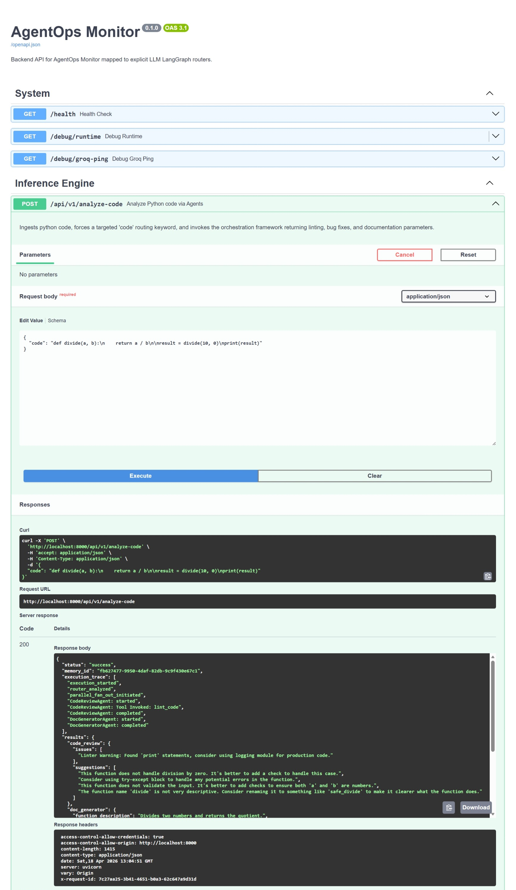

# AgentOps Monitor

AgentOps Monitor is a FastAPI backend that orchestrates multiple AI agents with LangGraph and Groq to analyze code, triage bugs, and produce structured developer-facing insights.

## Project Overview

- FastAPI service entrypoint at `src/main.py`
- Versioned API routes under `src/api/v1`
- Agent orchestration and routing in `src/agents` and `src/services`
- In-memory/session state handling in `src/memory`
- Runtime config via environment variables in `src/.env`
- Built-in health and debug endpoints for quick runtime validation

## Setup

### 1) Prerequisites

- Python 3.9 or newer
- `pip` installed
- A valid Groq API key

### 2) Install dependencies

From the project root:

```bash
cd src
pip install -r requirements.txt
```

### 3) Configure environment

Create your local environment file from the template:

```bash
cp .env.example .env
```

Update at least:

```env
GROQ_API_KEY="gsk_your-groq-api-key-here"
```

Optional values such as `PROJECT_NAME`, `ENVIRONMENT`, and `DEBUG` can also be customized in `.env`.

## How To Run

From the `src` directory:

```bash
uvicorn main:app --host 0.0.0.0 --port 8000 --reload or python main.py
```

Useful endpoints after startup:

- API docs: `http://localhost:8000/docs`
- Health check: `http://localhost:8000/health`
- Runtime diagnostics: `http://localhost:8000/debug/runtime`

## Example API Usage

Use Swagger UI for interactive testing, or call an endpoint directly.

### 1. Health Check
```bash
curl -X GET "http://localhost:8000/health"
```

Example response:

```json
{
  "status": "healthy",
  "service": "AgentOps Monitor"
}
```

### 2. Analyze Code
```bash
curl -X POST "http://localhost:8000/api/v1/analyze-code" \
     -H "Content-Type: application/json" \
     -d '{"code": "def divide(a, b): return a / b"}'
```

Example response:

```json
{
  "status": "success",
  "memory_id": "c1fcfb20-13a8-4de5-901c-6dcb304ac940",
  "execution_trace": [
    "CoordinatorAgent",
    "CodeReviewAgent"
  ],
  "results": {
    "CodeReviewAgent": "The code `def divide(a, b): return a / b` is missing a check for ZeroDivisionError. If `b` is 0, the program will crash."
  }
}
```

### 3. Analyze Bug
```bash
curl -X POST "http://localhost:8000/api/v1/analyze-bug" \
     -H "Content-Type: application/json" \
     -d '{"bug_description": "App crashes when user clicks submit without internet."}'
```

Example response:

```json
{
  "status": "success",
  "memory_id": "a5d0ef4a-81a1-42e1-881e-92fb108df1f8",
  "execution_trace": [
    "CoordinatorAgent",
    "BugTriageAgent"
  ],
  "results": {
    "BugTriageAgent": "The crash occurs because the network request does not handle connection exceptions. Wrap the submit request in a try-catch block and show an offline alert."
  }
}
```

## Screenshots

### Bug Analysis


### Code Analysis

