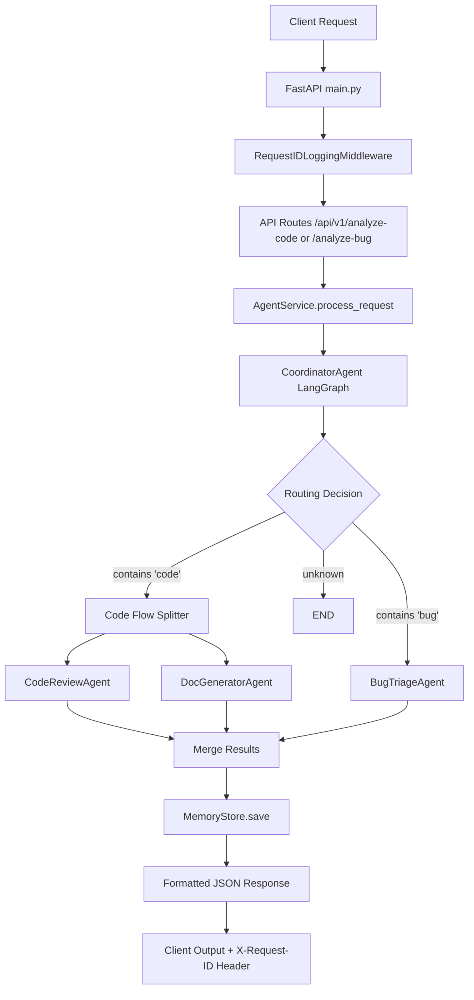

# AgentOps Monitor

A highly asynchronous, parallelized orchestration pipeline deploying advanced Large Language Models to evaluate software architecture, isolate code faults, and generate real-time developer API documentation completely natively utilizing LangGraph and Groq processing.

## Key Features
- **Parallel Asynchronous Executions**: Code is sent natively over Langgraph splitting into concurrent evaluations dynamically saving inference latency explicitly.
- **Trace Persistence**: Native dictionary routing structures caching all states globally dynamically across endpoints.
- **Custom Native Validation Tooling**: Integrated `tools/` routing natively reading Python Abstract Syntax Trees (AST) eliminating external binary failures.

## System Setup Instructions

### 1. Prerequisites
Ensure you have Python 3.9+ or higher installed on your environment.

### 2. Environment Configuration
You must map your Groq authorization explicitly. Copy the `.env.example` mapping to establish an explicit `.env` file in the application root:
```bash
cp .env.example .env
```

Ensure your `.env` contains your correct key:
```env
GROQ_API_KEY=gsk_your_api_key_here
APP_NAME="AgentOps Monitor"
LOG_LEVEL="INFO"
```

### 3. Installation
Install the necessary python pip dependencies natively:
```bash
pip install -r requirements.txt
```

### 4. Launching the Backend Server
Start the core FastAPI interface and architecture routing pipeline using Uvicorn:
```bash
uvicorn main:app --reload
```
The application natively establishes bindings on port 8000. 
You can visit `http://localhost:8000/docs` in your browser to inspect the complete interactive Swagger schema mapping testing.


## Architecture Topology

The application routes interactions structurally adhering to this flow:
1. `main.py` -> Ingests HTTP traffic dynamically injecting Middleware UUID identifiers onto payload streams.
2. `AgentService` -> Re-routes payload logic to standard text evaluations and manages structural save injections onto `MemoryStore` native indexes instantly.
3. `CoordinatorAgent` -> Initializes Python `StateGraph` logic resolving targeted explicit sub-agents depending dynamically on keyword constraints mapping to sequential branches explicitly!

*(A visual representation PNG is also located in this directory for architectural diagrams).*

## Request to Response Flow Diagram


